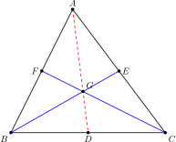
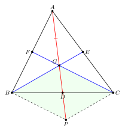

# From Finlay's Proof to the Theory of Parallelograms

**Date:** 2026-07-11  
**Project:** CGJteam Lab  
**Status:** First Milestone

---

## 1. Overview

The original objective of the CGJteam Lab project was intentionally modest: to produce a faithful formal verification of Ian Finlay's synthetic proof that the three medians of a triangle are concurrent.

Rather than designing a geometry library in advance, the development started from a single classical proof. During the formalization it became apparent that one particular part of Finlay's argument—the use of parallelograms—possesses a mathematical structure almost completely independent of the centroid theorem itself.

This observation naturally led to the extraction of an independent **Theory of Parallelograms**, providing reusable definitions, lemmas and theorems that extend far beyond the original proof.

---

## 2. Finlay's Construction

<b>Figure&nbsp;1.</b> Initial configuration. E and F are the midpoints of AC and AB, and G is the intersection of the medians BE and CF.

Let △ABC be a triangle.

Let E and F be the midpoints of AC and AB, respectively, and let

  G = BE ∩ CF.

The objective is to prove that G also lies on the third median of △ABC.

Finlay's key observation is that the original problem can be transformed into a statement about a parallelogram.

To achieve this, he introduces an auxiliary point P so that G is the midpoint of AP.

<b>Figure&nbsp;2.</b> Finlay's auxiliary construction. Point P is chosen so that G is the midpoint of AP.

The remainder of the proof consists of five elementary geometric steps.

---

## 3. Finlay's Five-Step Argument

### Step 1 — Application of the Midsegment Theorem

Since F and G are the midpoints of AB and AP in △ABP,

  FG ∥ BP.

Because C, F and G are collinear,

  CG ∥ BP.

Similarly, since E and G are the midpoints of AC and AP in △ACP,

  EG ∥ CP,

and therefore

  BG ∥ CP.

This step belongs entirely to the theory of midsegments and parallel lines.

---

### Step 2 — Recognition of a Parallelogram

Since

  CG ∥ BP

and

  BG ∥ CP,

quadrilateral BPCG is a parallelogram.

From this point onward, the proof relies almost exclusively on properties of parallelograms rather than on properties of the original triangle.

---

### Step 3 — The Diagonal Intersection

Let

  D = AP ∩ BC.

Since AP and BC are the diagonals of parallelogram BPCG, the point D is their intersection.

No further properties of the original triangle are required.

---

### Step 4 — Diagonals of a Parallelogram

The crucial mathematical ingredient is the theorem stating that the diagonals of a parallelogram bisect each other.

Hence D is the midpoint of BC.

Therefore AD is a median of △ABC.

Once this theorem becomes part of a reusable **Theory of Parallelograms**, the remainder of Finlay's proof follows almost immediately.

---

### Step 5 — Conclusion

Because G lies on AP and AP coincides with the median AD,

the point G belongs to the third median.

Consequently, the three medians of △ABC are concurrent.

---

## 4. From Proof to Theory

Although Finlay's proof is presented as a sequence of elementary geometric arguments, its mathematical content extends beyond the centroid theorem.

Several of its key ingredients naturally belong to an independent theory of parallelograms.

| Finlay's proof | Theory of Parallelograms |
| :--- | :--- |
| Recognition of a parallelogram | Definition of `IsParallelogram` |
| Diagonal intersection | Properties of diagonals |
| Diagonals bisect each other | Fundamental theorem |
| Midpoints of diagonals | Midpoint theory |
| Opposite sides | Parallelism and congruence theorems |

Viewed in this way, Finlay's proof is no longer merely a proof of a single theorem. Instead, it becomes a source of reusable mathematical structures that can be organized into an independent library module.

---

## 5. Impact on the Geometry Library

The most important consequence of the formalization was the realization that the parallelogram arguments form an almost self-contained mathematical theory.

Instead of viewing these arguments merely as intermediate steps in the proof of the centroid theorem, they can be organized into an independent library module containing

- definitions of parallelograms,
- diagonal theorems,
- midpoint properties,
- opposite-side properties,
- reusable construction lemmas.

This approach changes the role of formalization within the project.

Rather than verifying isolated theorems, formalization becomes a method for discovering reusable mathematical theories and organizing them into a coherent architecture.

Finlay's proof therefore becomes not only the first verified theorem of the project, but also the historical origin of the **Theory of Parallelograms** developed within the Geometry Library.

---

## 6. Towards a Theory of Parallelograms

The next stage of the project is no longer concerned with the centroid theorem itself.

Instead, the objective is to develop a reusable **Theory of Parallelograms** as an independent component of the Geometry Library.

Theorems originally introduced only to complete Finlay's proof are gradually reorganized into a coherent mathematical theory whose applications extend well beyond the original construction.

Future developments include:

- characterization of parallelograms,
- properties of opposite sides,
- diagonal theorems,
- midpoint properties,
- congruence results,
- reusable synthetic constructions.

The long-term goal is a modular geometry library in which the Theory of Parallelograms serves as a reusable foundation for many synthetic proofs, including—but by no means limited to—Finlay's theorem on the concurrency of triangle medians.

---

## References

- Ian Finlay, *Proving that the medians of a triangle are concurrent*, Mathematics Stack Exchange, 2013.  
  https://math.stackexchange.com/questions/411709/proving-that-the-medians-of-a-triangle-are-concurrent

---

*Document produced by CGJteam Lab.*
