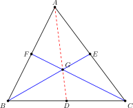
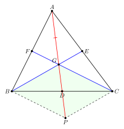

# Log 014 - From Finlay's Proof to Parallelogram Reasoning

## 1. Overview

The formalization of Finlay's proof exposed a particularly clear mathematical mechanism: an auxiliary parallelogram converts midpoint and parallel information into the midpoint required for the third median.

This log isolates that mechanism.

Its purpose is not to propose a finished module architecture or a universal protocol for parallelogram proofs. It records a recurring pattern observed in the Finlay argument and asks whether this pattern can support a reusable theory of parallelograms.

---

## 2. Finlay's Construction

<p align="center">

</p>

<p align="center">
<b>Figure&nbsp;1.</b> Initial configuration. E and F are the midpoints of AC and AB, and G is the intersection of the medians BE and CF.
</p>

Let \(\triangle ABC\) be a triangle.

Let \(E\) and \(F\) be the midpoints of \(AC\) and \(AB\), respectively, and let

$$
G = BE \cap CF.
$$

The objective is to prove that \(G\) also lies on the third median.

Finlay introduces an auxiliary point \(P\) so that \(G\) is the midpoint of \(AP\).

<p align="center">

</p>

<p align="center">
<b>Figure&nbsp;2.</b> Finlay's auxiliary construction. Point P is chosen so that G is the midpoint of AP.
</p>

This auxiliary construction creates the configuration from which the parallelogram argument emerges.

---

## 3. The Parallelogram Mechanism

### Step 1 - Parallel Relations

Since \(F\) and \(G\) are the midpoints of \(AB\) and \(AP\) in \(\triangle ABP\), the Midsegment Theorem gives

$$
FG \parallel BP.
$$

Using the collinearity of \(C,F,G\), this relation is transferred to

$$
CG \parallel BP.
$$

Similarly, in \(\triangle ACP\),

$$
EG \parallel CP,
$$

and the collinearity of \(B,E,G\) gives

$$
BG \parallel CP.
$$

Thus the midpoint configuration has been converted into the two parallel relations needed for the next stage.

### Step 2 - Parallelogram Recognition

The relations

$$
CG \parallel BP
$$

and

$$
BG \parallel CP
$$

identify \(BPCG\) as a parallelogram.

This is the point at which the proof temporarily leaves the original triangle problem and enters parallelogram geometry.

### Step 3 - Diagonal Configuration

The diagonals of \(BPCG\) are \(BC\) and \(PG\).

Let \(D\) denote their intersection.

Because \(A,G,P\) are collinear, the diagonal \(PG\) lies on the same supporting line as \(AP\). Thus the intersection can also be viewed in the original triangle configuration as the intersection of \(AP\) with \(BC\).

This identification is important: it connects the auxiliary parallelogram back to the line that will become the third median.

### Step 4 - Diagonal Bisection

The diagonals of a parallelogram bisect each other.

Therefore \(D\) is the midpoint of \(BC\).

Hence \(AD\) is a median of \(\triangle ABC\).

### Step 5 - Return to the Triangle

Since \(G\) lies on the line \(AP\), and \(D\) lies on the same line, the third median \(AD\) passes through \(G\).

The auxiliary parallelogram has therefore produced exactly the midpoint information needed to complete the original concurrency argument.

---

## 4. What the Formalization Revealed

The interesting feature is not merely that a parallelogram appears in Finlay's proof.

The argument has a recognizable internal pattern:

```text
midpoint information
        |
        v
parallel relations
        |
        v
parallelogram recognition
        |
        v
diagonal intersection
        |
        v
diagonal bisection
        |
        v
new midpoint
        |
        v
return to the original configuration
```

This pattern separates two kinds of work.

First, the proof must **create** a parallelogram configuration from information already available.

Second, it must **consume** a theorem about parallelograms to obtain new geometric information.

That distinction is useful when deciding which results should become reusable parts of the library.

---

## 5. Toward a Theory of Parallelograms

The Finlay experiment suggests several natural questions for a reusable parallelogram theory:

- How should a parallelogram be defined?
- Which criteria allow a quadrilateral to be recognized as a parallelogram?
- Which properties of opposite sides are derivable?
- Under which assumptions do the diagonals bisect each other?
- Which midpoint consequences can be exposed through a stable interface?
- Which of these results depend on incidence, parallelism, congruence, or order?

These questions are broader than the Finlay proof itself.

The proof provides one concrete use case from which the theory can be investigated, but it does not by itself determine the final organization of such a theory.

---

## 6. Architectural Caution

The original formalization made it tempting to describe the observed sequence as a general "protocol" for using parallelograms.

That conclusion would be premature.

What has actually been observed is one successful reasoning pattern:

```text
construct -> recognize -> use diagonals -> transfer result
```

Other synthetic proofs may use parallelograms differently.

The correct next step is therefore to collect further examples and determine which declarations and reasoning patterns recur independently of Finlay.

Only then can a stable parallelogram API or separate module be justified.

---

## 7. Conclusion

Finlay's proof revealed a coherent parallelogram mechanism inside a theorem about medians.

The key transformation is:

```text
triangle midpoint data
        |
        v
parallel configuration
        |
        v
auxiliary parallelogram
        |
        v
diagonal bisection
        |
        v
third median
```

This mechanism is sufficiently clear to motivate a separate investigation of parallelogram theory.

At this stage, however, it should be treated as evidence for a reusable component rather than as a finished architectural design.

---

## References

- Ian Finlay, *Proving that the medians of a triangle are concurrent*, Mathematics Stack Exchange, 2013.
