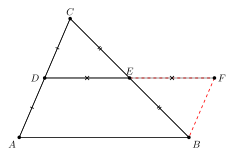

# Log-015
# MidsegmentParallel: A Reusable Construction Pattern

**Date:** 2026-07-20
**Project:** CGJteam Lab
**Status:** Mathematical Foundations

---

## 1. Overview

The previous log discussed the mathematical foundations of Finlay's proof through the Midsegment Theorem and the parallelogram framework.

A closer inspection of the Lean formalization reveals a more interesting picture.

The central object of the library is not the Midsegment Theorem itself, but the construction used to prove it.

In the current implementation this construction is formalized as the theorem

```lean
MidsegmentParallel
```

while the classical Midsegment Theorem is obtained as a short consequence of this more general result.

The construction therefore deserves to be viewed as an independent reusable proof component.

---

## 2. The Construction Behind the Midsegment Theorem

The proof begins with a simple auxiliary construction.

An endpoint of one side is extended to create a new point.

This additional point makes it possible to compare two triangles using the SAS congruence criterion.

Unlike many classical presentations, the proof is not centered on the midpoint theorem itself.

Instead, it develops a geometric configuration from which the desired parallelism naturally follows.

<p align="center">

</p>

<p align="center">
<b>Figure 1.</b>
Auxiliary construction leading to the MidsegmentParallel theorem.
</p>

---

## 3. Proof Architecture

The Lean proof separates naturally into six independent stages.

### Step 1 — Auxiliary Construction

A new point is constructed by extending one side of the triangle.

This prepares the configuration required for the congruence argument.

---

### Step 2 — Triangle Congruence (SAS)

The two constructed triangles are shown congruent using the SAS criterion.

This produces the equal sides and equal angles needed later.

---

### Step 3 — Deriving Parallelism

The equal angles obtained from SAS imply a first parallel relation.

This is achieved through a general principle relating equal corresponding angles and parallel lines.

---

### Step 4 — Recognition of a Parallelogram

The construction now provides one pair of opposite sides that are simultaneously

- parallel,
- congruent.

The quadrilateral is therefore recognized as a parallelogram.

---

### Step 5 — Applying a Parallelogram Property

Once the parallelogram has been identified, one of its fundamental properties immediately yields a new parallel relation.

---

### Step 6 — Transfer Along a Collinear Line

The final parallelism required by the theorem is obtained by transferring the previous relation along a collinear line.

This completes the construction.

---

## 4. The Midsegment Theorem

The classical Midsegment Theorem is now obtained almost immediately.

Only the symmetry of the midpoint relation is additionally required.

From the architectural point of view, the theorem is therefore a lightweight consequence of the more fundamental construction embodied in `MidsegmentParallel`.

---

## 5. Reusable Mathematical Components

One of the most interesting observations arising from the formalization is that the proof is assembled from several completely independent components.

```
Construction
        ↓
Triangle Congruence (SAS)
        ↓
Parallelism from Equal Angles
        ↓
Parallelogram Recognition
        ↓
Parallelogram Properties
        ↓
Collinearity Transfer
```

Each of these components is reusable in later developments.

The Midsegment Theorem is therefore not an isolated result but an example of a general construction pattern.

---

## 6. Connection with Finlay's Proof

The same construction pattern reappears in the proof of Finlay's centroid theorem.

In particular, the parallelogram component developed for `MidsegmentParallel` is reused almost unchanged.

This observation motivated the organization of the geometry library around reusable proof components rather than around individual theorems.

The resulting architecture separates elementary geometric principles from higher-level synthetic constructions, making the library both easier to understand and easier to extend.

---

## 7. Conclusion

The Lean formalization shows that the essential mathematical contribution is not merely a proof of the Midsegment Theorem.

More importantly, it identifies a reusable synthetic construction built from independent geometric components.

This construction subsequently becomes one of the principal building blocks in the formal proof of Finlay's theorem.
