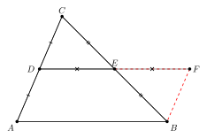

# Log 015 - Anatomy of the Midsegment Proof

## 1. Overview

The elimination of the `MidsegmentTheorem` axiom made the proof of the Midsegment Theorem itself an object of study.

The relevant Lean development is organized around

```lean
MidsegmentParallel
```

and exposes a sequence of geometric mechanisms that had previously been hidden behind the theorem interface.

The purpose of this log is to record that proof architecture.

The result should not yet be interpreted as a universal construction pattern for synthetic geometry. It is a detailed analysis of one successful proof and of the reusable ingredients that appear inside it.

---

## 2. The Auxiliary Construction

The proof begins by introducing an auxiliary point through an extension construction.

This changes the original midpoint configuration into one in which two triangles can be compared by congruence.

<p align="center">

</p>

<p align="center">
<b>Figure 1.</b>
Auxiliary construction used in the proof underlying `MidsegmentParallel`.
</p>

The auxiliary point is therefore not an incidental technical device. It creates the configuration required for the subsequent SAS argument.

---

## 3. Six Stages of the Proof

### Step 1 - Auxiliary Construction

A new point is introduced by extending the relevant side or segment.

The construction supplies the geometric relations needed to compare two triangles.

### Step 2 - SAS

The constructed triangles are related through a side-angle-side argument.

The SAS result provides congruence information, including the angle relation needed in the next stage.

### Step 3 - Parallelism from Equal Angles

An equality of appropriate angles is converted into a parallel relation.

Thus the congruence argument is used not as an endpoint, but as a bridge from metric information to parallel geometry.

Schematically:

```text
SAS
 |
 v
equal angles
 |
 v
parallelism
```

### Step 4 - Parallelogram Recognition

The construction supplies a pair of opposite sides satisfying the conditions required to recognize a parallelogram.

At this point the proof changes language again:

```text
congruence + parallelism
          |
          v
     parallelogram
```

### Step 5 - A Parallelogram Property

Once the quadrilateral has been recognized as a parallelogram, a general parallelogram result yields another parallel relation.

The proof therefore consumes a reusable theorem about parallelograms rather than reproducing its argument locally.

### Step 6 - Transfer Along Collinearity

The final required parallel relation is obtained by transferring the result along a collinear line.

This returns the auxiliary construction to the configuration occurring in the statement of the midsegment result.

---

## 4. The Resulting Proof Architecture

The complete route can be summarized as:

```text
auxiliary construction
        |
        v
SAS
        |
        v
equal-angle information
        |
        v
parallelism
        |
        v
parallelogram recognition
        |
        v
parallelogram property
        |
        v
transfer along collinearity
```

This graph is useful because it shows that the Midsegment Theorem is not being proved by a single specialized argument inside Lean.

Its proof crosses several parts of the geometry interface: construction, congruence, angle reasoning, parallelism, parallelograms, and collinearity.

This also corrects an earlier superficial impression that the Finlay development required little or no angle theory. Angle reasoning is present below the high-level `MidsegmentTheorem` interface.

---

## 5. Recovering the Classical Midsegment Interface

The theorem used by higher-level proofs is

```lean
MidsegmentTheorem
```

while the formally proved result is organized around

```lean
MidsegmentParallel.
```

As recorded in Log 012, midpoint symmetry bridges the difference between the two interfaces.

The resulting structure is:

```text
MidsegmentParallel
        |
        +-- midpoint symmetry
        |
        v
MidsegmentTheorem
        |
        v
higher-level proofs
```

Thus `MidsegmentTheorem` remains a convenient public theorem even though its proof is supplied through a differently organized internal result.

---

## 6. Reusable Ingredients

The proof contains several ingredients that are independently meaningful:

- an auxiliary extension construction,
- SAS congruence,
- extraction of angle information from congruence,
- a criterion turning equal angles into parallelism,
- parallelogram recognition,
- a parallelogram parallelism property,
- transfer of parallelism along collinear points.

This is stronger evidence for reusability than merely observing that the final theorem is useful more than once.

Each ingredient belongs to a recognizable mathematical operation that can potentially occur in unrelated synthetic proofs.

Whether these ingredients should become separate modules or stable API boundaries is a further architectural question and should be decided from additional examples.

---

## 7. Relation to Finlay

There are two different appearances of parallelogram reasoning in the development.

Inside the proof underlying `MidsegmentParallel`, a parallelogram is created as part of the argument establishing the midsegment parallel relation.

Later, the Finlay proof invokes the resulting Midsegment Theorem and then constructs another parallelogram in the centroid argument.

These should not be conflated.

The first parallelogram belongs to the proof **of the tool** used by Finlay.

The second belongs to the proof **of Finlay itself**.

This nested structure is one reason the dependency analysis became important:

```text
Finlay
  |
  v
MidsegmentTheorem
  |
  v
MidsegmentParallel proof
  |
  +--> SAS
  +--> angle reasoning
  +--> parallelogram reasoning
```

A high-level synthetic proof can therefore depend on geometric mechanisms that are no longer visible at its surface.

---

## 8. Conclusion

Log 015 records the internal architecture of the formally proved midsegment result.

The main finding is the sequence

```text
construction
 -> SAS
 -> equal angles
 -> parallelism
 -> parallelogram
 -> parallelism
 -> collinearity transfer
```

This sequence explains how several parts of the geometry library cooperate inside one classical theorem.

It also provides a concrete example of abstraction in the library: once this argument is packaged as `MidsegmentTheorem`, higher-level proofs such as Finlay can use the resulting parallelism without repeating the congruence, angle, and parallelogram reasoning underneath.
